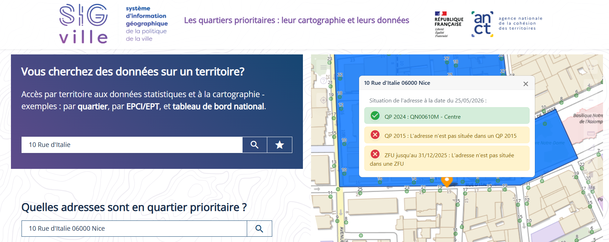
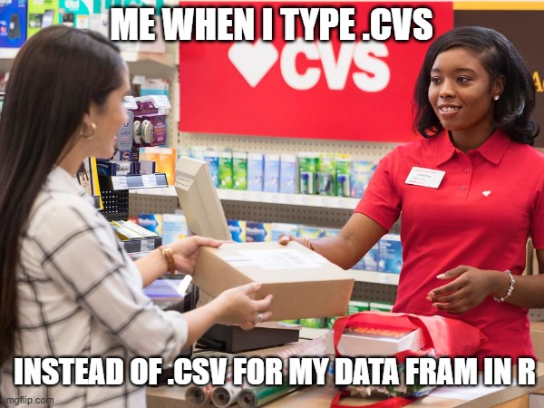

```{r setup, include=FALSE}
knitr::opts_chunk$set(echo = TRUE, message = FALSE, warning = FALSE, fig.path = "images/")
```

## Vérification du territoire (QPV)

Oui, l'agence est dans un QPV, selon le site <https://sig.ville.gouv.fr/>.



Les besoins des clients :

- **pas chers :** les gens ont besoin de trucs simples.
  Par exemple, une carte bancaire de base et un compte sans frais compliqués (ou gratuits).

- **petits crédits :** les petits commerçants du quartier ont besoin des micro-crédits pour rester ouvert.

- **épargne simple :** pour mettre de l'argent de côté, ils veulent des choses faciles comme le Livret A.

- **aide et conseils :** c'est important de parler avec eux et de donner des conseils de gestion simples.
  Pour éviter les gros problèmes d'argent et les dettes.

## Segmentation de la cientèle

Quand on sais déjà la quantité de groupes/clusters on veux, la methode pour travailler c'est le Clustering K-means.

```{r carregando-pacotes}
library(tidyverse)
library(cluster)
library(factoextra)
library(ggplot2)
library(dendextend)

```

```{r importando-dados}
dados <- read.csv("agence_nissa_bank.csv", stringsAsFactors = TRUE)
```



```{r explorando-estrutura-dados}
str(dados)
```

```{r explorando-variaveis}
summary(dados)
```

```{r}
names(dados)
```

```{r}
dados_modif <- rename(dados,
                id_client = "ID.Client",
                nom = "Nom",
                prenom = "Prénom",
                age = "Âge",
                situation = "Situation",
                revenu_mensuel = "Revenu.mensuel..",
                produits_detenus = "Produits.détenus",
                credit_en_cours = "Crédit.en.cours",
                epargne = "Épargne..")
```

```{r}
# removendo pelas posições (indica para dropar da coluna 1 até a coluna 3)
dados_modif <- select(dados_modif, -c(1:3))
```

```{r}
# cria um novo dataframe apenas com as colunas numéricas (age, revenu_mensuel, epargne)
dados_numericos <- select(dados_modif, where(is.numeric))

# cria um novo dataframe apenas com os fatores/categóricas (situation, credit_en_cours, etc.)
dados_categoricos <- select(dados_modif, where(is.factor))
```

1.  Calcular a Matriz de Correlação Rode a função cor() passando o seu dataframe numérico. O argumento use = "complete.obs" serve para o R ignorar linhas que tenham algum valor vazio (NA), evitando que o resultado dê erro.

```{r}
# Calcula a correlação de Pearson entre todas as colunas numéricas
matriz_cor <- cor(dados_numericos, use = "complete.obs")

# Exibe a matriz de números no console
print(matriz_cor)
```

Embora a renda e a poupança apresentem uma correlação linear positiva moderada/forte ($\rho = 0.675$), optou-se por manter ambas na segmentação.
No algoritmo de agrupamento K-means, elas representam dimensões distintas do comportamento do cliente (capacidade de ganho versus acumulação de patrimônio).
A eventual redundância geométrica é controlada pela aplicação da normalização Min-Max, preservando a variância essencial de cada perfil sem os problemas de inversão de matriz típicos de uma regressão linear.

```{r}
# Teste 1: Profissão vs Produtos
qui_1 <- chisq.test(table(dados_modif$situation, dados_modif$produits_detenus))

# Teste 2: Profissão vs Crédito
qui_2 <- chisq.test(table(dados_modif$situation, dados_modif$credit_en_cours))

# Teste 3: Produtos vs Crédito
qui_3 <- chisq.test(table(dados_modif$produits_detenus, dados_modif$credit_en_cours))

# Exibe os p-values para o seu relatório
cat("=== RESULTADOS DOS TESTES QUI-QUADRADO (P-VALUES) ===\n")
cat("Situação vs Produtos: ", qui_1$p.value, "\n")
cat("Situação vs Crédito:  ", qui_2$p.value, "\n")
cat("Produtos vs Crédito:  ", qui_3$p.value, "\n")
```

Os testes provam que as três variáveis são fortemente dependentes entre si.

O comportamento dos clientes da Nissa Bank não é aleatório.
A situação profissional de um cliente está diretamente amarrada ao tipo de produto que ele consome e ao tipo de crédito que ele pega.
Da mesma forma, o produto que ele tem dita o tipo de crédito que ele utiliza.

Esses resultados dão a validação científica perfeita para a escolha das suas features.Se um p-value desses tivesse dado maior que 0,05, significaria que a variável era "ruído" (irrelevante) e criar dummies para ela só serviria para deixar o algoritmo $K$-means confuso e lento.Como todas mostraram associações gigantescas, você acabou de provar que deixar as três variáveis na base e transformá-las em dummies é o caminho correto, pois cada uma delas carrega um padrão de comportamento único e crucial para desenhar os 4 perfis de clientes da agência.

```{r}
preparar_dados <- function(dataset) {
  matriz_dummies <- model.matrix(~ . - 1, data = dataset)
  df_dummies <- as.data.frame(matriz_dummies)
  
  normalizar_min_max <- function(x) {
    if (max(x) - min(x) == 0) return(x)
    return((x - min(x)) / (max(x) - min(x)))
  }
  
  dados_normalizados <- as.data.frame(lapply(df_dummies, normalizar_min_max))
  return(dados_normalizados)
}
```

```{r}
pronto_tudo <- preparar_dados(dados_modif)
```

```{r elbow-test}
# Gráfico do Cotovelo (Rosa Neon)
fviz_nbclust(pronto_tudo, kmeans, method = "wss", linecolor = "#FF10F0") +
  labs(title = "Teste do Cotovelo (Método WSS)", x = "Número de Clusters K", y = "Soma os Quadrados Dentro")

```

```{r silhouette-method}
# Gráfico da Silhueta Média (Verde Neon)
fviz_nbclust(pronto_tudo, kmeans, method = "silhouette", linecolor = "#FF10F0") +
  labs(title = "Teste do Coeficiente de Silhueta", x = "Número de Clusters K", y = "Silhueta Média")
```


```{r dendrogram-cluster-hierarchical}
# 1. Calcula a matriz de distância geométrica
matriz_distancia <- dist(pronto_tudo, method = "euclidean")

# 2. Executa o agrupamento hierárquico (Método de Ward)
modelo_hierarquico <- hclust(matriz_distancia, method = "ward.D2")

# 3. Converte o resultado para um objeto dendrograma
dend <- as.dendrogram(modelo_hierarquico)

# 4. Colore as ramificações dos 4 grupos com as cores neon (processamento otimizado)
dend <- color_branches(dend, k = 4, col = c("#39FF14", "#FF10F0", "#FF5F1F", "#00FFFF"))

# 5. Plota o dendrograma modificado removendo os rótulos individuais das folhas (leaflab = "none")
plot(dend, leaflab = "none", main = "Dendrograma de Clientes - Análise Exploratória", 
     xlab = "Clientes", ylab = "Distância")
```


```{r}
# ==============================================================================
# EXECUÇÃO DOS DOIS MODELOS EM PARALELO (4 E 8 CLUSTERS)
# ==============================================================================

# Garante que os resultados sejam sempre os mesmos ao rodar
set.seed(123)

# Modelo A: A preferência do negócio (4 Clusters)
modelo_k4 <- kmeans(pronto_tudo, centers = 4, nstart = 25)
dados_modif$cluster_4 <- as.factor(modelo_k4$cluster)

# Modelo B: O ideal matemático (8 Clusters)
modelo_k8 <- kmeans(pronto_tudo, centers = 8, nstart = 25)
dados_modif$cluster_8 <- as.factor(modelo_k8$cluster)

# ==============================================================================
# COMPARAÇÃO DO TAMANHO DOS GRUPOS
# ==============================================================================

cat("=== DISTRIBUIÇÃO DOS CLIENTES EM 4 CLUSTERS ===\n")
print(table(dados_modif$cluster_4))
cat("\n")

cat("=== DISTRIBUIÇÃO DOS CLIENTES EM 8 CLUSTERS ===\n")
print(table(dados_modif$cluster_8))
```

```{r}
# ==============================================================================
# PERFILAMENTO DOS 4 CLUSTERS (K = 4)
# ==============================================================================
cat("\n#########################################################\n")
cat("                CARACTERÍSTICAS DOS 4 CLUSTERS             \n")
cat("#########################################################\n\n")

# 1. Numéricas (Mediana) para 4 clusters
perfil_num_k4 <- aggregate(cbind(age, revenu_mensuel, epargne) ~ cluster_4, data = dados_modif, FUN = median)
perfil_num_k4[, 2:4] <- round(perfil_num_k4[, 2:4], 2)
print("=== NUMÉRICAS (Mediana) ===")
print(perfil_num_k4)

# 2. Categóricas (Proporção) para 4 clusters
cat("\n=== CATEGÓRICAS: Situação Profissional (%) ===\n")
print(round(prop.table(table(dados_modif$cluster_4, dados_modif$situation), margin = 1), 4) * 100)

cat("\n=== CATEGÓRICAS: Produtos Detidos (%) ===\n")
print(round(prop.table(table(dados_modif$cluster_4, dados_modif$produits_detenus), margin = 1), 4) * 100)

cat("\n=== CATEGÓRICAS: Crédito em Curso (%) ===\n")
print(round(prop.table(table(dados_modif$cluster_4, dados_modif$credit_en_cours), margin = 1), 4) * 100)


# ==============================================================================
# PERFILAMENTO DOS 8 CLUSTERS (K = 8)
# ==============================================================================
cat("\n\n#########################################################\n")
cat("                CARACTERÍSTICAS DOS 8 CLUSTERS             \n")
cat("#########################################################\n\n")

# 1. Numéricas (Mediana) para 8 clusters
perfil_num_k8 <- aggregate(cbind(age, revenu_mensuel, epargne) ~ cluster_8, data = dados_modif, FUN = median)
perfil_num_k8[, 2:4] <- round(perfil_num_k8[, 2:4], 2)
print("=== NUMÉRICAS (Mediana) ===")
print(perfil_num_k8)

# 2. Categóricas (Proporção) para 8 clusters
cat("\n=== CATEGÓRICAS: Situação Profissional (%) ===\n")
print(round(prop.table(table(dados_modif$cluster_8, dados_modif$situation), margin = 1), 4) * 100)

cat("\n=== CATEGÓRICAS: Produtos Detidos (%) ===\n")
print(round(prop.table(table(dados_modif$cluster_8, dados_modif$produits_detenus), margin = 1), 4) * 100)

cat("\n=== CATEGÓRICAS: Crédito em Curso (%) ===\n")
print(round(prop.table(table(dados_modif$cluster_8, dados_modif$credit_en_cours), margin = 1), 4) * 100)
```

analise por cluster

```{r}
# ==============================================================================
# RESUMO INDIVIDUALIZADO POR PERSONA (K = 4)
# ==============================================================================

for (i in 1:4) {
  cat("\n==================================================================\n")
  cat(paste("                      PERFIL DA PERSONA", i, "\n"))
  cat("==================================================================\n")
  
  # Isola os dados apenas do cluster iterado no momento
  dados_cluster <- subset(dados_modif, cluster_4 == i)
  
  # Calcula o tamanho do grupo em relação ao total da agência
  tamanho <- nrow(dados_cluster)
  proporcao_base <- round((tamanho / nrow(dados_modif)) * 100, 2)
  cat(paste("Volume de Clientes: ", tamanho, " (", proporcao_base, "% da base total)\n\n", sep = ""))
  
  # Indicadores Numéricos (Mediana)
  cat("--- Indicadores Numéricos ---\n")
  cat("• Idade:           ", median(dados_cluster$age), "anos\n")
  cat("• Renda Mensal:     €", round(median(dados_cluster$revenu_mensuel), 2), "\n")
  cat("• Poupança:         €", round(median(dados_cluster$epargne), 2), "\n\n")
  
  # Indicadores Categóricos (Exibe apenas as categorias presentes no grupo > 0%)
  cat("--- Comportamento Categórico Interno ---\n")
  
  cat("\n> Situação Profissional (%):\n")
  freq_sit <- round(prop.table(table(dados_cluster$situation)) * 100, 2)
  print(freq_sit[freq_sit > 0])
  
  cat("\n> Produtos Detidos (%):\n")
  freq_prod <- round(prop.table(table(dados_cluster$produits_detenus)) * 100, 2)
  print(freq_prod[freq_prod > 0])
  
  cat("\n> Crédito em Curso (%):\n")
  freq_cred <- round(prop.table(table(dados_cluster$credit_en_cours)) * 100, 2)
  print(freq_cred[freq_cred > 0])
}
```

```{r}
# ==============================================================================
# ANÁLISE DE AFINIDADE (LIFT) PARA CROSS-SELLING E UP-SELLING
# ==============================================================================

cat("\n#########################################################\n")
cat("        CÁLCULO DE LIFT (AFINIDADE) POR CLUSTER            \n")
cat("#########################################################\n")

# 1. Calcula a proporção de cada produto e crédito na base TOTAL da agência
prop_base_produtos <- prop.table(table(dados_modif$produits_detenus))
prop_base_credito <- prop.table(table(dados_modif$credit_en_cours))

# 2. Loop para calcular e imprimir o Lift para cada um dos 4 clusters
for (i in 1:4) {
  cat("\n==================================================================\n")
  cat(paste("                      LIFT - CLUSTER", i, "\n"))
  cat("==================================================================\n")
  
  # Filtra os dados apenas para o cluster atual
  dados_cluster <- subset(dados_modif, cluster_4 == i)
  
  # Calcula a proporção de produtos e créditos dentro do cluster
  prop_cluster_produtos <- prop.table(table(dados_cluster$produits_detenus))
  prop_cluster_credito <- prop.table(table(dados_cluster$credit_en_cours))
  
  # Calcula o Lift (Proporção no Cluster dividida pela Proporção na Base Geral)
  lift_produtos <- prop_cluster_produtos / prop_base_produtos
  lift_credito <- prop_cluster_credito / prop_base_credito
  
  # Exibe os resultados separados entre o que deve ser ofertado e o que deve ser evitado
  cat("\n> PRODUTOS PARA CROSS-SELLING (Alta Afinidade | Lift > 1):\n")
  produtos_fortes <- round(lift_produtos[lift_produtos > 1], 2)
  if(length(produtos_fortes) > 0) print(sort(produtos_fortes, decreasing = TRUE)) else cat("Nenhum produto em destaque.\n")
  
  cat("\n> PRODUTOS PARA EVITAR (Baixa Afinidade | Lift < 1):\n")
  produtos_fracos <- round(lift_produtos[lift_produtos < 1], 2)
  if(length(produtos_fracos) > 0) print(sort(produtos_fracos)) else cat("Nenhum produto fraco.\n")
  
  cat("\n------------------------------------------------------------------\n")
  
  cat("> CRÉDITOS PARA CROSS-SELLING (Alta Afinidade | Lift > 1):\n")
  creditos_fortes <- round(lift_credito[lift_credito > 1], 2)
  if(length(creditos_fortes) > 0) print(sort(creditos_fortes, decreasing = TRUE)) else cat("Nenhum crédito em destaque.\n")
  
  cat("\n> CRÉDITOS PARA EVITAR (Baixa Afinidade | Lift < 1):\n")
  creditos_fracos <- round(lift_credito[lift_credito < 1], 2)
  if(length(creditos_fracos) > 0) print(sort(creditos_fracos)) else cat("Nenhum crédito fraco.\n")
}
```

------------------------------------------------------------------------

## Arguments pour un bon système de gestion de données commerciales

Donnez 3 arguments solides.

1.  Segmentação Precisa e Aumento de Vendas (Cross-selling) Um sistema de gestão de dados estruturado e limpo é o pré-requisito fundamental para aplicar algoritmos de inteligência artificial, como a clusterização K-means que você acabou de executar.
    Ele permite cruzar histórico de transações com dados demográficos para calcular a afinidade de produtos (Lift).
    Sem esse sistema, o banco faria ofertas genéricas; com ele, a agência consegue direcionar a campanha de microcrédito exatamente para a persona com maior probabilidade de conversão.

2.  Eficiência Operacional e Mitigação de Riscos de Crédito A integração de dados comerciais elimina silos de informação dentro da agência.
    Quando o gerente acessa o perfil de um cliente, ele vê o quadro completo em tempo real (idade, renda, poupança e créditos ativos).
    Isso não apenas acelera o tempo de atendimento presencial, mas fornece uma base matemática segura para a análise de risco, evitando a concessão de limite de cheque especial ou novos empréstimos para perfis com alta probabilidade de inadimplência.

3.  Conformidade Regulatória e Segurança da Informação (RGPD) Operando na França, a gestão rigorosa de dados de clientes é uma exigência legal imposta pelo Regulamento Geral sobre a Proteção de Dados (RGPD).
    Um sistema comercial sólido garante que informações financeiras sensíveis sejam armazenadas com criptografia adequada e controle de acesso.
    Além disso, permite gerenciar o consentimento dos clientes e executar rapidamente solicitações de direito ao esquecimento ou portabilidade de dados, blindando a agência contra vazamentos e multas severas.
