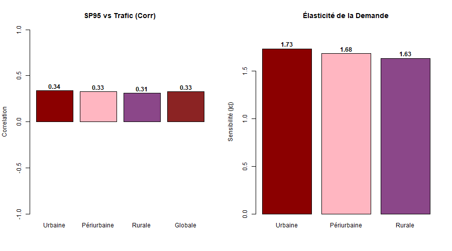

```{r}
# carregar a base de dados (ajuste o read.csv2 conforme o seu separador)
carburant <- read.csv2("carburanttt.csv", dec=",", sep=";", stringsAsFactors=FALSE)

str(carburant)
summary(carburant)
```

## netoyage
```{r}
# 1. Apagar colunas "X" (mantemos apenas as colunas da 1 à 16)
df_clean <- carburant[, 1:16]

# 2. Remover linhas completamente vazias do final do Excel
df_clean <- df_clean[df_clean$Date != "", ]

# 3. Remover o símbolo " €" e converter preços para numérico
df_clean$Prix_SP95   <- as.numeric(gsub(" €", "", gsub(",", ".", df_clean$Prix_SP95)))
df_clean$Prix.Gazole <- as.numeric(gsub(" €", "", gsub(",", ".", df_clean$Prix.Gazole)))

# 4. Limpar e converter as colunas de Variação (%) - a causa do erro de NAs
df_clean$Var.SP95..   <- as.numeric(gsub("%", "", gsub(",", ".", df_clean$Var.SP95..)))
df_clean$Var.Trafic.. <- as.numeric(gsub("%", "", gsub(",", ".", df_clean$Var.Trafic..)))
df_clean$Var.TC..     <- as.numeric(gsub("%", "", gsub(",", ".", df_clean$Var.TC..)))
df_clean$Var.Gazole.. <- as.numeric(gsub("%", "", gsub(",", ".", df_clean$Var.Gazole..)))

# 5. Converter as demais colunas absolutas e de índice (que vieram como texto)
df_clean$Trafic.Routier <- as.numeric(df_clean$Trafic.Routier)
df_clean$Voyageurs.TC   <- as.numeric(df_clean$Voyageurs.TC)
df_clean$Index.SP95     <- as.numeric(gsub(",", ".", df_clean$Index.SP95))
df_clean$Index.Trafic   <- as.numeric(gsub(",", ".", df_clean$Index.Trafic))

# 6. Remover a primeira linha de cada zona (Janeiro de 2019), pois não há variação percentual para o 1º mês
df_clean <- na.omit(df_clean)
```
r signale juste que les 4 colonnes de variation (var_sp95, var_trafic...) sont vides en janvier vu qu'il n'y a pas le mois precedent pour comparer. il met des "na" a la place

cacher les avis
```{r}
# Ocultar o aviso de NAs intencionais durante a conversão
df_clean$Var.SP95..   <- suppressWarnings(as.numeric(gsub("%", "", gsub(",", ".", df_clean$Var.SP95..))))
df_clean$Var.Trafic.. <- suppressWarnings(as.numeric(gsub("%", "", gsub(",", ".", df_clean$Var.Trafic..))))
df_clean$Var.TC..     <- suppressWarnings(as.numeric(gsub("%", "", gsub(",", ".", df_clean$Var.TC..))))
df_clean$Var.Gazole.. <- suppressWarnings(as.numeric(gsub("%", "", gsub(",", ".", df_clean$Var.Gazole..))))

# Remoção limpa de Janeiro de 2019
df_clean <- na.omit(df_clean)
```

les memes etapes d'avant
```{r}
### 2. Création des Subsets par Zone (Base limpa)
Urbain <- subset(df_clean, Zone == "Urbaine")
Peri   <- subset(df_clean, Zone == "Périurbaine")
Rural  <- subset(df_clean, Zone == "Rurale")

### 3. Calcul des Corrélations sur les VARIATIONS 
cor_Urbain_SP95_Trafic <- cor(Urbain$Var.SP95.., Urbain$Var.Trafic..)
cor_Peri_SP95_Trafic   <- cor(Peri$Var.SP95.., Peri$Var.Trafic..)
cor_Rural_SP95_Trafic  <- cor(Rural$Var.SP95.., Rural$Var.Trafic..)
cor_Global_SP95_Trafic <- cor(df_clean$Var.SP95.., df_clean$Var.Trafic..)

### 4. Calcul de l'Élasticité Directe
# Isolamento dos meses com flutuação de preço diferente de zero
valid_Urbain <- subset(Urbain, Var.SP95.. != 0)
valid_Peri   <- subset(Peri, Var.SP95.. != 0)
valid_Rural  <- subset(Rural, Var.SP95.. != 0)

# Cálculo de elasticidade limpo
elast_Urbain <- mean(valid_Urbain$Var.Trafic.. / valid_Urbain$Var.SP95.., na.rm = TRUE)
elast_Peri   <- mean(valid_Peri$Var.Trafic.. / valid_Peri$Var.SP95.., na.rm = TRUE)
elast_Rural  <- mean(valid_Rural$Var.Trafic.. / valid_Rural$Var.SP95.., na.rm = TRUE)

### 5. Synthèse des Résultats (Mesmo formato que elas usaram)
tableau_final <- data.frame(
  Zone = c("Urbaine", "Périurbaine", "Rurale", "Globale"),
  Correlation_Var = c(cor_Urbain_SP95_Trafic, cor_Peri_SP95_Trafic, cor_Rural_SP95_Trafic, cor_Global_SP95_Trafic),
  Elasticite = c(elast_Urbain, elast_Peri, elast_Rural, NA)
)

print(tableau_final)

### 6. Visualisations Simples (Sauvegarde PNG ET Affichage dans le Rmd)

# Abre o canal para criar e salvar o arquivo de imagem no computador
png(filename = "graficos_elasticidade_corrigidos.png", width = 900, height = 500)

# configura a grade e as cores originais do grupo
par(mfrow=c(1,2)) 
zones <- c("Urbaine", "Périurbaine", "Rurale", "Globale")
couleurs <- c("darkred", "lightpink", "orchid4", "brown4")

# Desenha o Gráfico 1 (Correlação de Variação)
bp1 <- barplot(tableau_final$Correlation_Var,
               names.arg = zones,
               col = couleurs,
               main = "SP95 vs Trafic (Corr)",
               ylab = "Correlation",
               ylim = c(-1, 1)) 

text(bp1, 
     ifelse(tableau_final$Correlation_Var > 0, tableau_final$Correlation_Var + 0.05, tableau_final$Correlation_Var - 0.05), 
     round(tableau_final$Correlation_Var, 2), 
     cex = 1, col = "black", font = 2)

# Desenha o Gráfico 2 (Elasticidade Filtrada)
bp2 <- barplot(abs(tableau_final$Elasticite[1:3]), 
               names.arg = zones[1:3],
               col = couleurs[1:3],
               main = "Élasticité de la Demande",
               ylab = "Sensibilité (|ε|)",
               ylim = c(0, max(abs(tableau_final$Elasticite[1:3]), na.rm=TRUE) + 0.2))

text(bp2, 
     abs(tableau_final$Elasticite[1:3]) + 0.05, 
     round(abs(tableau_final$Elasticite[1:3]), 2), 
     cex = 1, col = "black", font = 2)

# Salva e fecha o arquivo físico no disco rígido (obrigatório)
dev.off()

# Força o R Markdown a carregar e exibir a imagem salva dentro do relatório final

```


